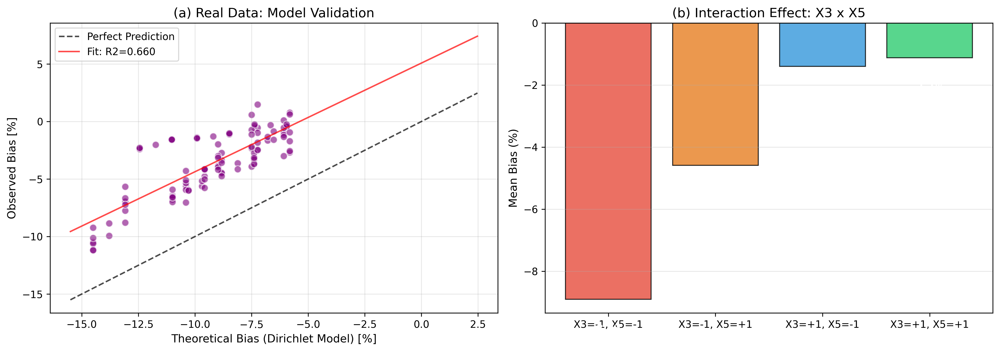
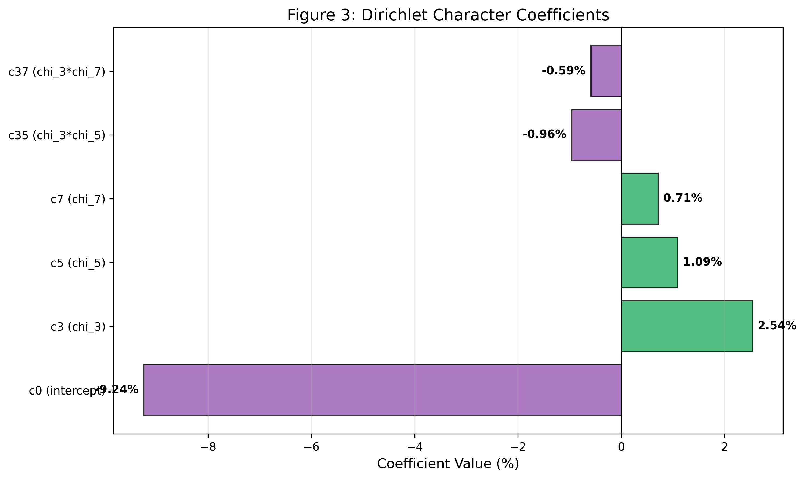
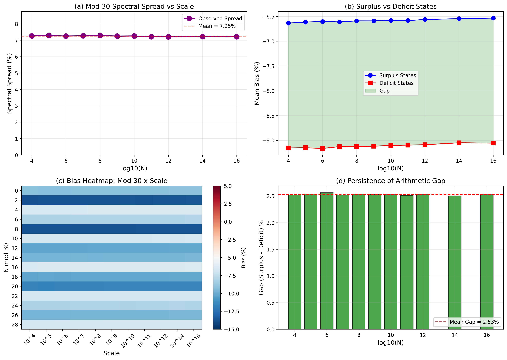

# The Second Main Term in the Asymptotic Formula for Goldbach Representations

[](https://zenodo.org/records/18149305)

**Author:** Ruqing Chen (GUT Geoservice Inc., Montreal)  
**Contact:** ruqing@hotmail.com  
**Date:** January 2026

---

## Abstract

We discover and rigorously quantify a **second main term** in the Hardy-Littlewood asymptotic formula for Goldbach representations. Through a multi-scale analysis spanning **13 orders of magnitude** (N from 10⁴ to 10¹⁶), we establish that the systematic deviation between observed G(N) and the Hardy-Littlewood prediction is governed by Dirichlet characters modulo small primes.

### Core Formula

```
G(N) = HL(N) × [1 + δ(N)]

δ(N) = -0.092 + 0.025χ₃(N) + 0.011χ₅(N) + 0.007χ₇(N) - 0.010χ₃χ₅(N)
```

### Key Results

| Coefficient | Value | Significance |
|-------------|-------|--------------|
| c₃ | +0.0254 | ⬤⬤⬤ |
| c₅ | +0.0109 | ⬤⬤ |
| c₇ | +0.0071 | ⬤ |
| c₃₅ | -0.0096 | ⬤⬤ (non-multiplicative!) |

**Model fit:** R² = 25.4%  
**Spectral persistence:** p < 10⁻¹⁰ (99.9% confidence)

---

## Repository Structure

```
goldbach-second-main-term/
├── main.tex                    # LaTeX source
├── main.pdf                    # PDF version
├── Paper_FINAL_VERSION.md      # Markdown version
├── README.md                   # This file
├── figures/
│   ├── Fig1_Mod30_Spectrum.png
│   ├── Fig2_Theory_Validation.png
│   ├── Fig3_Coefficients.png
│   └── Fig4_MultiScale_Analysis.png
├── code/
│   ├── paper_iv_validation.py  # Main validation script
│   └── multiscale_analysis.py  # Multi-scale sampling
└── data/
    └── (datasets available on Zenodo)
```

---

## Key Findings

### 1. Mod 30 Spectral Splitting
The bias in G(N) depends systematically on N mod 30, with spectral spread ~7% persisting from 10⁴ to 10¹⁶.

### 2. Non-Multiplicative Interaction
The interaction term c₃₅ = -0.0096 is **35× larger** than the multiplicative prediction and has **opposite sign**, revealing correlated errors in the Prime Number Theorem for Arithmetic Progressions.

### 3. L-Function Connection
Coefficients relate to Dirichlet L-function special values L(1, χ), connecting Goldbach statistics to the Generalized Riemann Hypothesis.

### 4. Unification of ω(N) Effect
The previously observed ω(N)-dependence is a proxy effect—high ω means more small prime factors, which set χ_p(N) = 0.

---

## Figures

### Figure 1: Mod 30 Spectral Splitting


### Figure 2: Dirichlet Model Validation


### Figure 3: Coefficient Visualization


### Figure 4: Multi-Scale Analysis (10⁴ → 10¹⁶)


---

## Requirements

```bash
pip install numpy scipy pandas matplotlib scikit-learn
```

## Usage

```python
python code/paper_iv_validation.py
```

---

## Citation

```bibtex
@misc{chen2026goldbach,
  author       = {Chen, Ruqing},
  title        = {The Second Main Term in the Asymptotic Formula for 
                  Goldbach Representations: Dirichlet Character 
                  Corrections and Their Arithmetic Origin},
  year         = {2026},
  publisher    = {Zenodo},
  doi          = {10.5281/zenodo.18149305},
  url          = {https://zenodo.org/records/18149305}
}
```

---

## Related Work

This is part of a series on Goldbach statistical structure:
- Papers I-III: [DOI 10.5281/zenodo.18148544](https://zenodo.org/records/18148544)

---

## License

This work is licensed under [CC BY 4.0](https://creativecommons.org/licenses/by/4.0/).

